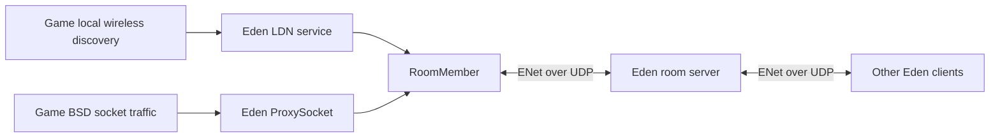
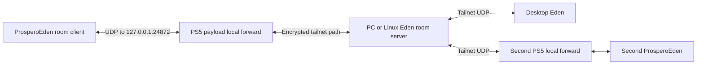

# ProsperoEden local wireless multiplayer over the internet

Implementation and validation plan for [ProsperoEden issue #98](https://github.com/blackbearreloaded/ProsperoEden/issues/98).

Prepared: 2026-10-10. Implementation is based on upstream `main` at `dfda802`, on
`feature/ldn-rooms`. See [implementation status](MULTIPLAYER_IMPLEMENTATION.md) for
completed offline validation and remaining hardware gates. Issue #89 is a separate
future follow-up and is excluded from this work.

## 1. Outcome and scope

Let a PS5 running ProsperoEden join an existing Eden room, launch a supported game, and play through the game's **local wireless** mode with another PS5 or desktop/Android Eden user. Each player runs an independent game instance and keeps their own save. The room carries discovery and game packets. It does not stream video or synchronize emulator save states.

Support two ways to reach the same room client:

1. An ordinary room address on the LAN or internet.
2. A local UDP forward supplied by an existing PS5 Tailscale payload, leading to a private room server in the player's tailnet.

The first release needs direct connection, nickname, optional room password, room status, member information, leave, and useful failure messages. Use an existing PC/Linux room server. Public room browsing and hosting a server on the PS5 can follow separately.

This plan does not implement Nintendo online services, PSN integration, a Tailscale client inside ProsperoEden, general guest internet access, rollback netplay, or compatibility with physical Switch consoles. Native game LAN mode is a separate validation track; success in local wireless does not establish LAN-mode support. Other emulator families are not advertised as compatible without specific tests.

The approach follows [Eden's multiplayer model](https://github.com/eden-emulator/mirror/blob/master/docs/user/Multiplayer.md): join a room first, then use the game's local wireless mode. Game and emulator versions must be recorded and compatibility tested, rather than inferred from a shared brand name or room protocol version.

## 2. Evidence and corrections to the initial discussion

### Initial investigation baseline

| Item | Inspected baseline |
|---|---|
| Development repository | `C:/Users/denis/Documents/PS5/workspace/dev/ps5-eden-feasibility` |
| Development HEAD | `0109b7f4330733c2f69c4e334fe529b46addb223`, branch `experiment/compatibility-horizon` |
| Pinned Eden | `5f142c7926d0c7fcbbd0ce30794d72f638a43b2a`, from `UPSTREAM.json` |
| Local Eden source | `.deps/mirror-5f142c7926d0c7fcbbd0ce30794d72f638a43b2a` under the development repository |
| holdmysocks Tailscale | `e4986b4d52af6a63f9be14d9de616d267c566de1` |
| atreus04-GG Tailscale | `d99261c21b678d9637a92c88168e1f4a72563040` |

The development tree already had unrelated changes when inspected. They remain untouched.
Implementation uses an isolated worktree based on upstream `main` at `dfda802`, with the
same pinned Eden revision above; it does not build on the development branch. The WSL
source location recorded in `AGENTS.md` was unavailable during the initial investigation;
the local pinned source above was used. Verify candidate hashes before deployment.
A source finding is not proof of the installed binary's behavior.

### What is already present

- Upstream `src/CMakeLists.txt` adds the `network` library unconditionally. `src/network/CMakeLists.txt` links `common`, `enet::enet`, and Boost headers. `ENABLE_WEB_SERVICE` adds optional web functionality.
- The native build passes `YUZU_ROOM=OFF`, `YUZU_ROOM_STANDALONE=OFF`, and `ENABLE_WEB_SERVICE=OFF`. The first two disable dedicated-room functionality/executables; they do **not** by themselves remove the room client library. The earlier assertion that the room code is simply not built was too broad. Confirm final link retention and generated build inputs rather than flipping these switches indiscriminately.
- `Network::Init()` in `src/network/network.cpp` initializes ENet and creates the global room/member objects. No call to this room initializer or its `Network::Shutdown()` counterpart was found in the inspected ProsperoEden `headless` sources. Upstream's Qt frontend supplies that lifecycle.
- `Network::NetworkInstance` in the emulator core manages the separate internal socket lifecycle. It does not substitute for room initialization. The similar names must not lead to double initialization or cleanup.
- `LANDiscovery::SendPacket()` sends through a connected `RoomMember`. It does not contain a roomless UDP LAN-broadcast fallback. Thus the pinned implementation's local wireless path should be tested with a room even when both machines are in one home. The initial issue's proposed serverless local-wireless step is not established by this source.
- Guest BSD socket creation selects `Network::ProxySocket` when the room member reports connected. Guest socket traffic and LDN discovery are separate packet classes carried by the room.
- Existing PS5 adaptations replace internal socket wakeup pipes with a socket pair and use the `getifaddrs` interface path. Route discovery remains explicitly unqualified. These adaptations are foundations, not multiplayer acceptance evidence.

References: [build graph](https://github.com/eden-emulator/mirror/blob/5f142c7926d0c7fcbbd0ce30794d72f638a43b2a/src/CMakeLists.txt), [network library](https://github.com/eden-emulator/mirror/blob/5f142c7926d0c7fcbbd0ce30794d72f638a43b2a/src/network/CMakeLists.txt), [room initialization](https://github.com/eden-emulator/mirror/blob/5f142c7926d0c7fcbbd0ce30794d72f638a43b2a/src/network/network.cpp), [LDN implementation](https://github.com/eden-emulator/mirror/blob/5f142c7926d0c7fcbbd0ce30794d72f638a43b2a/src/core/hle/service/ldn/lan_discovery.cpp), [BSD service](https://github.com/eden-emulator/mirror/blob/5f142c7926d0c7fcbbd0ce30794d72f638a43b2a/src/core/hle/service/sockets/bsd.cpp).

## 3. Architecture to preserve



The room protocol already supplies membership, virtual addresses, discovery forwarding, and directed packet routing. Reuse its serialization, compression, reliability, and address semantics. Do not create a PS5-specific wire format.

At the pinned revision:

- `network_version` is `1`, `DefaultRoomPort` is `24872`, and `NumChannels` is `1` in `src/network/room.h`.
- `RoomMember::Join()` accepts a server host, port, nickname, password, preferred virtual IP, and optional token. Use `NoPreferredIP` and let the server allocate virtual addresses. Keep token empty for a private room configured for anonymous access.
- Both LDN and proxy packets travel through the ENet room connection. Its inspected send path uses reliable ENet packets. Preserve this initially; changing reliability to tune latency would be a separate protocol/performance investigation.
- LDN broadcast is a flag inside the room protocol. The server distributes those messages to room members. The outer network only needs an ordinary connection to the room's UDP endpoint.
- The room-assigned address seen by the guest is different from the PS5's LAN address, its Tailscale address, and the local forwarding endpoint. Never substitute one for another.

A room server relays gameplay traffic as well as introducing players. Its location and bandwidth therefore affect every match. A room's member limit is also different from the game's maximum player count.

## 4. Code ownership and proposed changes

Paths in this table are relative to the development repository. Upstream paths are inside the pinned Eden source directory. New filenames are proposals, not existing interfaces.

| Area | Existing integration point | Planned change |
|---|---|---|
| App/session lifecycle | `headless/main.cpp` | Initialize room networking before game services are created; coordinate join, game launch, return, profile change, and exit. |
| Small room controller | Proposed `headless/multiplayer.h` and `.cpp` | Own frontend callback handles, serialize join/leave operations, expose copied state to the launcher, and request normal session shutdown after connection loss. |
| Build integration | `headless/CMakeLists.txt`, `headless/inject.cmake`, `tools/build-headless-native.sh` | Add controller sources; verify ENet's native target and linkage; make only demonstrated platform adaptations. |
| Saved settings | `headless/settings_store.h` | Add last room host/port and nickname using existing JSON load/atomic-write behavior. |
| Launcher service boundary | `headless/prosperoeden/pe/ui/services.hpp`, `headless/prosperoeden/eden_services.h` and `.cpp` | Expose connect, cancel, leave, and snapshot operations through the existing service pattern. |
| Launcher UI | `headless/prosperoeden/pe/ui/launcher.hpp`, `launcher.cpp`, `settings.cpp`; proposed `multiplayer.cpp` if warranted | Add Multiplayer navigation, connection form, room/member view, and error/status presentation. Reuse established widgets and text entry facilities where available. |
| Host UI preview | `headless/prosperoeden/host/fake_services.hpp` and `.cpp` | Supply deterministic disconnected/joining/joined/error fixtures for visual and navigation checks. |
| Guest LDN/network behavior | Upstream `src/core/hle/service/ldn/*`, `sockets/bsd.cpp`, `nifm/nifm.cpp`, `src/core/internal_network/*` | Preserve working upstream behavior. Add narrowly scoped corrections only when source evidence or tests require them. |
| Protocol validation | Upstream `src/network/packet.*`, `room_member.cpp`, LDN receiver, proxy decompression | Validate the newly exposed remote-input path before internet testing. |
| Documentation | This plan; later a user guide under `docs/` | Publish exact tested versions, supported titles, direct-connect setup, Tailscale forwarding, and limits. |

Keep upstream adaptations reproducible through the repository's existing overlay/patch mechanism. Do not hand-edit disposable build output or silently alter the cached upstream baseline. Separate lifecycle, platform fixes, packet validation, and UI commits so they can be reviewed independently.

## 5. Lifecycle and concurrency contract

### Initialization and connection

1. After app logging/platform setup, initialize the room subsystem exactly once, before creating any per-game BSD/LDN services that bind room callbacks. Keep the global room objects alive until those services are destroyed. Match the core's existing internal socket ownership rather than adding another `NetworkInstance`.
2. If ENet initialization fails, report Multiplayer unavailable and preserve offline use. Do not terminate the launcher for a room feature failure.
3. Bind frontend callbacks once. Copy status into an owned snapshot or queue consumed on the launcher/main thread. Do not call rendering, game teardown, or UI APIs from ENet callbacks.
4. Execute `Join()` on the existing appropriate worker mechanism, or one small serialized worker if none fits. The inspected implementation has a 5-second ENet connection wait plus hostname resolution. The launcher must remain responsive throughout both.
5. Treat only `Joined` or `Moderator` as a completed join. At this pin `IsConnected()` also returns true in `Joining`; it is not a sufficient UI or game-launch gate.
6. Keep game launch disabled during a join attempt. The user can cancel and then launch offline, or wait for room acceptance. Do not join a room midway through a running game: BSD socket type is chosen at creation time.

### Cancellation and ownership

- Serialize `Join`, `Leave`, retry, and final shutdown. Never destroy an ENet host concurrently with a blocking join or its receive loop.
- Audit name-resolution and connection waits for bounded cancellation. If upstream cannot cancel promptly, add a narrow cancellation-aware wait while preserving protocol behavior. A UI that says canceled but leaves a worker accessing destroyed objects is not acceptable.
- `RoomMember` callback documentation warns that binding/unbinding from within a callback can deadlock. Queue those operations to the owner instead.
- Getters returning references, including member information, need a safe copying strategy. Inspect the update locks; do not read a mutating vector directly from the render thread. If necessary, add a small locked snapshot accessor or copy at a synchronized callback boundary.
- Give attempts/session updates an identity so a stale failure from an earlier attempt cannot overwrite a newer room's status. Keep this within the controller; no generic task framework is needed.

### Game start, end, and connection loss

- Join first, then launch. Verify guest services register both LDN and proxy receive callbacks against the live room member.
- The core already sends game name/ID/version on load and clears game information during normal shutdown. Reuse this rather than duplicating announcements in the launcher.
- On a normal return to the library, retain a healthy room connection. Destroy per-game services, unbind their callbacks, clear game-specific state, and show the room again. A second game launch must start without old packets or service references.
- On room connection loss during gameplay, enqueue one notification and request the existing orderly return-to-launcher path. Do not automatically rejoin the live game or pretend its LDN session survived. Reconnect in the launcher and relaunch.
- Inspect the interval between loss detection and teardown: new guest sockets must not unexpectedly switch from room proxying to native internet traffic. If needed, preserve the session's socket-routing mode until teardown or fail new socket requests consistently. Test this explicitly.
- Leave on profile switch; use that profile's chosen nickname for the next join. On app exit, finish game shutdown and callback cleanup, stop/join frontend work, leave the room, then shut down ENet. Keep all referenced owners alive until their callbacks are quiescent.
- Game-load failures and early guest-fault recovery must unwind the same way. Review the existing automatic retry path so it does not restart a multiplayer game into a half-destroyed session.

## 6. Implementation phases and gates

### Phase 0 — Establish a reproducible reference

Tasks:

- Reconfirm the source baseline, active development branch, native SDK, generated overlays, and installed candidate. Preserve unrelated working-tree changes.
- Inspect the final native link map/build commands for `network`, `RoomMember`, and ENet. Distinguish source-library availability from functions removed by linker dead stripping.
- Build or obtain a private desktop room server and two desktop clients with recorded revisions. First use the same pinned protocol implementation; then qualify the current official Eden release independently.
- Demonstrate desktop-to-desktop local wireless discovery and actual gameplay for the first title, with matching game updates and a save that has unlocked multiplayer.
- Record a reference sequence: room acceptance, assigned virtual addresses, LDN scan/response, host creation, joining, game socket exchange, match completion, leave.

Gate: the PC reference works and its versions/configuration are recorded. If it does not, fix that control before diagnosing PS5 behavior. No implementation should depend on the moving `master` branch implicitly.

### Phase 1 — Qualify native UDP and ENet

Use a minimal diagnostic from the same app execution context as ProsperoEden; a privileged payload test alone does not prove app-sandbox access.

Check:

- IPv4 UDP bind/send/receive, nonblocking operation, errno translation, socket close, and waits interrupted during teardown.
- Numeric room address first, hostname resolution second. Check native sockaddr length/layout, byte order, ENet platform conditionals, timing, threading, and socket-buffer assumptions.
- Interface enumeration, selected IPv4 interface, subnet information, and behavior with no network. Prefer the active physical interface rather than accidentally selecting loopback. Do not invent a gateway just to silence a failure.
- ENet connect, room join, packet exchange, disconnect, failed join, and retry against the PC reference server.
- Burst and fragmented-message tests using observed room traffic sizes. Small successful echo packets alone do not qualify ENet.

Raw host broadcast and multicast are diagnostic requirements for native LAN mode, not prerequisites for the room's virtual broadcast path. Keep their results separate.

Gate: repeated native joins and bidirectional room packets pass without leaked sockets, thread hangs, or offline regressions. Leave dedicated-server and web-service options disabled on PS5 unless a specific missing dependency proves otherwise.

### Phase 2 — Connect the headless frontend to the existing guest paths

- Add initialization and the controller described above. Start with development-only direct-connect configuration so transport can be tested before the UI is complete.
- Verify `IUserLocalCommunicationService::Initialize()` gets a selected interface and binds its callback. The pinned implementation returns an airplane-mode error if either requirement fails; diagnose the actual cause instead of masking the error.
- Verify NIFM's connection/IP reports are consistent with LDN state and the room-assigned virtual address. Inspect `EmuNetState` refresh behavior with the PS5's current zero-gateway fallback.
- Confirm `BSD_USA::SocketImpl()` creates `ProxySocket` for the room session and that proxy packets reach the correct guest descriptor. LDN discovery alone is not proof of gameplay transport.
- Start with a title using the supported datagram path. Several stream-oriented `ProxySocket` methods are stubbed at this pin; do not claim general TCP/LAN compatibility from a passing UDP title.
- Keep guest internet-access settings at their established offline defaults unless a measured requirement justifies a scoped change. Room transport itself does not require Nintendo account authentication.

Gate: PS5 and PC see each other inside the game's local wireless menu, connect, exchange actual game state, and return cleanly. Test both which device creates the in-game session; that role is separate from hosting the external room server.

### Phase 3 — Validate remote input before internet exposure

This phase addresses concrete inspected code, not a whole-repository security audit.

`LANDiscovery::ReceivePacket()` copies `NetworkInfo` or `NodeInfo` from packet payloads without a local size check. `RoomMember`'s inspected handlers invoke callbacks after a sequence of packet reads without checking parse success in those handlers. Trace the parser's guarantees, then close any uncovered boundary before allowing internet rooms.

Required behavior:

- Reject truncated/invalid room messages before callbacks; validate packet type, family/protocol enums, lengths, and required fields.
- Require each LDN message's payload to have its expected size before copying. Reject invalid node counts/indices or state transitions before indexing arrays or admitting clients.
- Bound variable-length allocations and proxy decompression using protocol/guest limits established from source and reference traffic. Do not choose an arbitrary tiny limit that breaks legitimate packets.
- Bound application queues or apply explicit backpressure/failure behavior so a stalled game or malformed peer cannot grow memory indefinitely.
- Avoid logging passwords, authentication tokens, raw save/game payloads, or Tailscale node state. Rate-limit repeated malformed-packet diagnostics.

Tests: valid upstream messages still interoperate; truncated LDN structures, malformed sizes/enums, oversized compressed data, repeated connection requests, and teardown with packets in flight fail cleanly. Use host sanitizer tests where practical. Reuse existing tests; add focused cases at the newly exercised boundary.

Gate: normal desktop interoperation remains intact and malformed input cannot produce unchecked copies, unbounded allocations, or teardown races in the exercised path.

### Phase 4 — Add the launcher flow

Add a Multiplayer entry using existing navigation and widgets. Required fields: room address, port, nickname, password. Default the port from `Network::DefaultRoomPort`, not a separately maintained magic number. Accept numeric IPv4 and hostnames; qualify IPv6 before advertising it.

The connected view shows room name, members, each member's reported game/version where available, and Leave. It explains: **Join this room, start the same game, and select Local Wireless in the game.** Room membership is not an in-game match.

Show specific errors for name collision, wrong password, protocol mismatch, full room, ban/kick, connection timeout/loss, and native networking failure. Do not collapse a wrong password into “check Wi-Fi.” A failed attempt must allow editing and retry without restarting the app.

Persist only the last endpoint and nickname initially. Keep passwords in memory for the current app session and exclude them from diagnostic dumps. Missing configuration must preserve offline behavior. Use existing input facilities where suitable; if the launcher lacks a reusable text-entry adapter, add the narrow service operation needed for these fields and its host-preview equivalent. Confirm password masking.

Example proposed addition to the existing settings file, not a replacement of it:

```json
{
  "multiplayer": {
    "host": "room.example.net",
    "port": 24872,
    "nickname": "PlayerOne"
  }
}
```

Validate lengths against the server's actual nickname/password rules, port range 1–65535, empty/invalid hosts, and text encoding. Reuse localization, large-text, high-contrast, and controller conventions. No PSN/Nintendo sign-in or Tailscale key entry belongs in this flow.

Gate: UI previews cover the states, controller/text input works on PS5, joining never blocks rendering/input, and settings migration preserves existing profiles and game overrides.

### Phase 5 — Qualify ordinary internet rooms

- Repeat the local reference with clients on different internet connections and a controlled room server.
- Use the room's UDP port, normally 24872. The server's firewall/router must permit it when publicly reachable; ordinary clients should not require arbitrary guest-port forwarding.
- Record server distance, measured latency, loss, game versions, host role, and match outcome. Separate protocol success from play quality.
- Exercise server shutdown, client network loss, wrong password, full room, incompatible protocol, duplicate nickname, and immediate retry after failure.
- Change one variable at a time. Compare wired first, then Wi-Fi under the same game/scene conditions.

Gate: complete an agreed short gameplay scenario in both host roles, then repeat from a fresh app launch. Only extend session duration after satisfying the workspace's current run-duration/performance rules.

### Phase 6 — Validate Tailscale using the existing payloads

Follow section 7. This is a transport validation of the same room client, not a second multiplayer implementation.

Gate: at least one pinned PS5 payload successfully carries room discovery, gameplay, idle/resume traffic, and controlled reconnect. Document the other project's exact status rather than treating both as interchangeable.

### Phase 7 — Release qualification and handoff

- Run the regression/compatibility matrix in section 8. Publish qualified combinations, known errors, and unsupported modes.
- Package/freeze/verify through existing tools; record the candidate hash, game version, server/client revisions, and payload release/hash when applicable.
- Update `COMPATIBILITY_STATE.md` and the relevant performance/experiment records with concise evidence after actual tests, not with this plan's expectations.
- Prepare a user guide and release note describing local wireless through rooms. Keep public-room browsing, PS5 server hosting, and unrelated LAN improvements in separate follow-up work.

## 7. Tailscale integration and validation

### 7.1 Addressing and discovery

Tailscale is a routed overlay, not a shared Ethernet broadcast domain. Do not depend on a game's LAN broadcast discovery crossing it. With rooms, the discovery broadcasts are encapsulated inside the room protocol and sent to one known server endpoint. This is why the room design fits Tailscale without a broadcast bridge. See [Tailscale's networking model](https://tailscale.com/docs/concepts/tailscale-osi).

Both linked PS5 projects run a node/proxy inside their own process. Neither supplies a system-wide Tailscale interface to ProsperoEden. A `100.x.x.x` address appearing in a dashboard does not mean the game app can dial it directly.

### 7.2 Primary candidate: holdmysocks/ps5-tailscale

The inspected project exposes local TCP/UDP forwards. Its UDP relay uses a per-client flow and returns datagrams to that client's local address. The inspected flow expiry is two minutes of inactivity, with a bounded 256-datagram outgoing queue; overflow may drop packets. These are concrete idle/load test targets, not proof of incompatibility.

Sources: [pinned README](https://github.com/holdmysocks/ps5-tailscale/blob/e4986b4d52af6a63f9be14d9de616d267c566de1/README.md), [local forward implementation](https://github.com/holdmysocks/ps5-tailscale/blob/e4986b4d52af6a63f9be14d9de616d267c566de1/tsd/localforward.go), [UDP relay implementation](https://github.com/holdmysocks/ps5-tailscale/blob/e4986b4d52af6a63f9be14d9de616d267c566de1/tsd/udprelay.go).

Recommended topology:



Configuration procedure, after ordinary room connectivity works:

1. Put the room-server PC/Linux device and participating devices on a tailnet with access to the room's UDP port. Run the room server bound to a reachable interface/address. Allow UDP 24872 in its host firewall. Do not assume tailnet membership overrides ACLs/grants.
2. Start exactly one selected PS5 Tailscale payload and register it using that project's dashboard. Verify its actual build/firmware support and healthy connection status. Do not run the two linked implementations simultaneously; they may conflict over files and ports.
3. In the holdmysocks dashboard, configure an outbound UDP forward to the room server. The equivalent **fragment to merge into the payload's existing configuration** is:

```json
{
  "forwards": [
    {
      "proto": "udp",
      "listen": "127.0.0.1:24872",
      "target": "eden-room-pc:24872"
    }
  ]
}
```

4. Replace `eden-room-pc` with the real tailnet device name or address. Preserve existing forward entries and all other payload settings. Prefer the dashboard; follow its restart instructions for the selected release if editing configuration by hand.
5. In ProsperoEden, enter host `127.0.0.1`, port `24872`, and the ordinary room nickname/password. The transport destination is local; the guest's virtual address still comes from the room.
6. Desktop clients with normal Tailscale routing connect directly to `eden-room-pc:24872`. Each additional PS5 gets its own local forward to that same room. Devices then use the game's local wireless mode.

If the local port is occupied, use another free local port such as 24873 and keep the target at 24872. Change the ProsperoEden connection port to match. No new protocol or guest networking setting is required.

For this outbound-client topology, do not add the room port to the payload's inbound `udpPorts` merely to make it work; that setting serves the opposite direction. Do not use its HTTP proxy for ENet. The normal PS5 network interface should remain selected for guest interface checks; there is no kernel Tailscale interface to select.

Mandatory Tailscale checks:

- Cross-process loopback UDP from the actual ProsperoEden app to the payload works in the deployed sandbox/elevation configuration.
- The local relay preserves datagram boundaries, reply endpoint behavior, and stable flow mapping for an ENet session.
- Two PS5s and a PC can coexist without nickname/virtual-IP/flow collisions.
- Record whether each client-to-room leg is direct or relayed by Tailscale, using the payload dashboard/desktop tools. A successful room join does not prove a direct path or acceptable latency.
- Spend more than two minutes in the lobby, then start gameplay; distinguish application inactivity from ENet keepalive traffic. Exercise a genuinely expired/recreated relay flow with a diagnostic where practical.
- Test room traffic near observed maximum packet sizes and under modest loss/jitter. Record fragmentation/retransmission and queue-drop behavior; do not change MTU, queue sizes, or thread priority speculatively.
- Stop/restart the payload or make the room endpoint unreachable while connected. ProsperoEden should report connection loss and recover through the launcher. Tailscale restart must not trigger an automatic live-game rejoin.
- Compare FPS/frame times and room round-trip time with the same scene using direct networking and the Tailscale forward. Check that the daemon's scheduling does not starve either game or relay.

ProsperoEden should not read Tailscale auth keys, modify payload settings automatically, install a payload, or claim knowledge of tailnet status it cannot observe. A generic room endpoint is enough for initial support; document the forwarding setup. “Tailscale tested” is a compatibility result, not a new network mode in the core.

### 7.3 Secondary candidate: atreus04-GG/ps5tailscale

The [pinned README](https://github.com/atreus04-GG/ps5tailscale/blob/d99261c21b678d9637a92c88168e1f4a72563040/README.md) describes PS5-resident Remote Play proxies and explicitly excludes system-wide VPN behavior. Source review now confirms the missing facility at this pin: [`libtailscale_auth_probe.c`](https://github.com/atreus04-GG/ps5tailscale/blob/d99261c21b678d9637a92c88168e1f4a72563040/src/libtailscale_auth_probe.c#L699) starts the Remote Play proxy, then explicitly skips outbound dialing. The [libtailscale patch](https://github.com/atreus04-GG/ps5tailscale/blob/d99261c21b678d9637a92c88168e1f4a72563040/patches/libtailscale-59d4bb8-ps5.patch#L450) listens inside tsnet on fixed Remote Play ports and sends accepted traffic to the PS5's native LAN address. It does not expose a configurable native-loopback listener dialing an arbitrary tailnet UDP target. Classify this revision as **unsupported for this room topology**, not as a failed PS5 multiplayer test.

Investigation branch:

1. Inspect the selected release's daemon/proxy implementation and libtailscale interface for outbound UDP dialing, datagram preservation, configurable loopback listeners, and reply routing.
2. If an existing facility provides that contract, map it to the same single-room topology and run exactly the holdmysocks acceptance tests.
3. If it does not, record the gap. A separate, narrow contribution to that payload could expose one configurable outbound UDP forward using its existing node. It would need per-client reply routing, cancellation, idle cleanup, bounded buffers, and no open LAN-wide listener by default.
4. Treat that contribution as optional separate work. Do not block the ordinary room feature or the holdmysocks validation on it, and do not embed another Tailscale runtime in ProsperoEden to compensate.

Remote Play success, an inbound FTP connection, or a pingable PS5 tailnet address does not prove the required outbound ENet path. Rest-mode support is irrelevant to an actively running local-wireless game and is not a multiplayer acceptance criterion.

### 7.4 Fallback without a compatible PS5 payload

An optional PC on the PS5's physical LAN can run Tailscale and a narrowly bound UDP forward to the remote room. ProsperoEden connects to that PC's LAN address/forward port. Validate it as a separate topology; a subnet router alone does not automatically give outbound tailnet routes to the PS5. This is a fallback for investigation, not a requirement for users of a qualified PS5 payload.

## 8. Validation matrix and evidence

Record every row as not run, pass, fail, or unsupported with a reason. Do not mark hardware behavior passed because a source read looks favorable.

| Scenario | Required result | Evidence |
|---|---|---|
| Desktop reference, same versions | Discover, join, complete chosen gameplay scenario | Client/server revisions, game/update, logs |
| PS5 to PC room on same LAN | Accepted join and stable packet exchange | Native socket/ENet results, room membership |
| PS5 to PC local wireless, each game-host role | Discovery and real game-state exchange | LDN/proxy counters, gameplay observation |
| PS5 to PS5 through room | Both roles work; independent saves | Candidate hashes, room/server record |
| PS5 to current official desktop Eden | Explicit compatibility pass or diagnosed difference | Release/commit/protocol/game versions |
| Android Eden peer | Qualify separately if advertised | Device/client build and same gameplay checks |
| Ordinary internet room | Playable match and predictable disconnect | RTT/loss, server location, match result |
| holdmysocks local forward | Same room/game behavior over tailnet | Payload release/hash, config without secrets |
| Tailscale direct and relayed paths | Measure both; state quality limits | Per-leg path and latency, frame-time comparison |
| Tailscale lobby idle/flow recreation | No silent permanent stall | More-than-two-minute idle, subsequent exchange |
| atreus04-GG payload | Qualify outbound UDP or document absent facility | Release-specific source/probe result |
| Wrong password/name collision/full room/version mismatch | Specific error and successful later retry | Controller state transitions |
| Cancel during resolution/join | Responsive UI, no stale callbacks/host use | Attempt timeline, resource counts |
| Server/payload/network loss | Bounded return and reconnect from launcher | Shutdown timing, socket/thread counts |
| Exit/relaunch/profile switch/game-load failure | No stale packets, identities, or callbacks | Repeated lifecycle sequence |
| Malformed remote packets | Clean rejection with bounded resources | Focused host/native tests |
| Offline game launch and return | Existing behavior preserved | Representative Vulkan and OpenGL checks |
| Native LAN mode without room | Independent optional result | Title/mode-specific socket and discovery trace |

Use Mario Kart 8 Deluxe local wireless as the first candidate because the workspace has extensive game familiarity, but establish the desktop control first. For the second title, select another locally owned LDN-capable game with multiplayer unlocked. Match game updates/DLC where relevant; initially disable gameplay-altering mods, cheats, speed changes, and frame-generation comparisons. Restore each user's preferences afterward.

Collect compact metrics: join duration, final room state/error, assigned virtual IP, LDN packet counts by type, proxy packet/byte counts, ENet RTT/loss where available, selected host interface, session end reason, socket/thread counts across repeated sessions, and matched frame-time/FPS windows. Full logs stay on disk. Avoid per-packet logging in performance runs.

Use controlled network impairment on the PC side after the baseline passes: for example 20/50/100 ms added round-trip delay, low jitter, and 0.5–1% loss as characterization points, not promised support thresholds. Verify the actual applied RTT; do not confuse a one-direction delay setting with round-trip delay. Identify the first user-visible degradation and timeout behavior without inventing a universal acceptable ping.

Acceptance should require actual gameplay completion in repeated fresh sessions, correct visuals/audio, unchanged save ownership, and predictable cleanup. “Room joined,” “players visible,” and “gameplay completed” are separate milestones.

## 9. Workspace and console operating rules

Before implementation or hardware work, reread `AGENTS.md`, the active portion of `PERFORMANCE_STATE.md`, and the native deployment protocol. This document does not supersede them.

- Work on development code; preserve published release artifacts, ROMs, keys, and saves. No console action is part of writing this plan.
- Resolve the current console-sharing/lock instruction before any run: the existing files contain differently dated lock/waiver statements. Never assume exclusive console ownership from this plan. Do not run console runners concurrently.
- Before each hardware experiment, fill the repository's experiment template with evidence, hypothesis, expected result, rejection criterion, and next decision. After two inconclusive attempts on one hypothesis, reassess.
- Use focused host/native checks first. For a PS5 candidate use the existing package, freeze, and verify workflow; capture the exact installed hash.
- Keep initial tests within the authorized short-run window (normally 210 seconds) and close the game afterward. Longer gameplay/soak tests remain gated by the current workspace performance/duration rules; request a specific exception only if those rules prevent a necessary test. Do not silently reinterpret them for networking work.
- The two-minute relay-idle case can fit in a short diagnostic without running a game. Do not extend gameplay merely to collect more metrics.
- Compare the same scene, resolution, replay/input, cache state, and measurement window for networking overhead. Correctness failures invalidate performance claims.
- Update experiment/compatibility state after completed tests. No performance-state update is warranted merely because a plan was written.

## 10. Suggested implementation order and completion checklist

Suggested reviewable changes, adjusting boundaries if the existing code makes a smaller complete change possible:

1. Record the desktop reference and correct the networking assumptions in development notes.
2. Add native transport diagnostics and only the ENet/platform fixes those tests require.
3. Add room lifecycle/controller integration with meaningful cancellation and teardown tests.
4. Add the demonstrated packet-validation fixes and their regression cases before internet testing.
5. Qualify LDN plus proxy traffic on PS5; make any required interface/NIFM corrections separately.
6. Add settings and launcher UI, including host-preview coverage and controller/text entry checks.
7. Run internet and Tailscale qualification; add user documentation and exact tested combinations.

The direct-room feature is complete when a user can enter an endpoint, join, launch a qualified game, play with another device, leave/reconnect, and return to offline use without restarting or losing saves. Tailscale support is complete when the documented forward works with a pinned payload in actual gameplay and failure recovery, with measured limitations. If the atreus04-GG project lacks outbound UDP, explicitly record that result and the extension needed; do not label it supported.

Deferred work: public room discovery, web accounts/tokens for rooms that require them, chat/moderation UI, hosting rooms on PS5, general serverless LAN support, physical Switch interoperability, automatic payload configuration, and networking optimizations without a measured bottleneck. None is necessary to deliver the first interoperable direct-room client.

Issue [#89](https://github.com/blackbearreloaded/ProsperoEden/issues/89) is a future follow-up, explicitly excluded from this implementation. This work addresses [#98](https://github.com/blackbearreloaded/ProsperoEden/issues/98); its acceptance gates do not imply support for #89.

## 11. Remaining questions to answer through implementation

1. Which native candidate/build inputs are actually current, and does its ENet archive already execute correctly on PS5?
2. Does the selected app execution context permit the required UDP and cross-process loopback operations?
3. Does physical-interface selection plus the existing NIFM behavior suffice, including through a loopback forward?
4. Can join/DNS cancellation meet the existing launcher responsiveness and shutdown contract without wider upstream changes?
5. Are room-member snapshots and guest receive callbacks safe across game teardown at this pin?
6. Which upstream parser/decompression guarantees exist, and which narrow bounds checks must be added?
7. Does the current official Eden release remain wire-compatible with the pinned build beyond the version integer?
8. Which games and update combinations pass local wireless, and which fail due to existing guest-service limitations?
9. What latency, relay flow behavior, and scheduling overhead do the two PS5 Tailscale projects exhibit in the actual tested builds?

These are explicit evidence gaps. This plan establishes the implementation path and acceptance tests; it does not claim multiplayer or either payload has been validated on the console.
